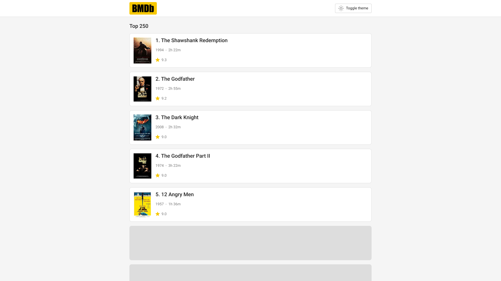
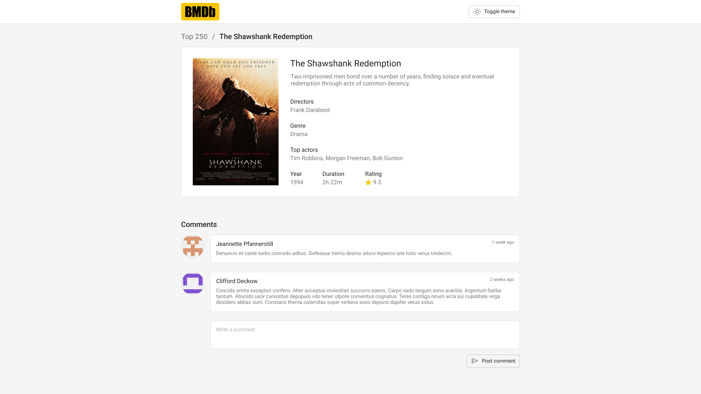

# Beatgrid fullstack React + Java/Kotlin assignment

Welcome to the Beatgrid fullstack React + Java/Kotlin assignment.

The goal of this assignment is to test your ability to work with lo-fi design files and to converting them to a beautifully designed web application. Furthermore, this assignment will test your ability to write clean, understandable, and maintainable code.

Good luck!

---

## Assignment

Your task is to build the **Beatgrid Movie Database**, and specifically the listing of the **Top 250** movies.

### Required features

- A list displaying the Top 250 movies.
- A details page with the movie's details, as well as comments.
- The ability to add comments.
- Navigation between the Top 250 page and the details page.
- Light / dark theme support (optional)

## Design

To give you some inspiration, there are already some designs available. Consider these designs as lo-fi. If you can come up with a better design, please do.

### Home page

### Details page

---

## Components

### Database

To run the database:
* make sure you have [Docker](https://docs.docker.com/) installed
* navigate to the `database` folder
* run `docker compose up -d`
* import data by running `cat init.sql | mysql -h localhost -u root --port 53306 --protocol TCP`

The database is now accessible on port `53306`.

The backend application is already set up to connect to the database.

### Backend

The backend exists in two flavors: Java and Kotlin. Choose your preferred language.

To run the app:
* make sure you have Java 17+ installed
* navigate to the `backend-java` or `backend-kotlin` folder
* run `./gradlew bootRun`

You now have access on `localhost:8080`.

### Frontend

The frontend is bootstrapped with [Vite](https://vitejs.dev/) (using the React + Typescript variant) and [Yarn](https://yarnpkg.com/).

To run the app, run `yarn dev` or simply `vite`. The app will be available at `http://localhost:5173/`

---

## Notes

- You can use a component library if you want, such as [MUI](https://mui.com/), [Mantine](https://mantine.dev/), [Ant](https://ant.design/), or [Chakra](https://chakra-ui.com/).
- The logo in the toolbar can be found at [here](/public/logo.svg).
- This assignment should take about a day.